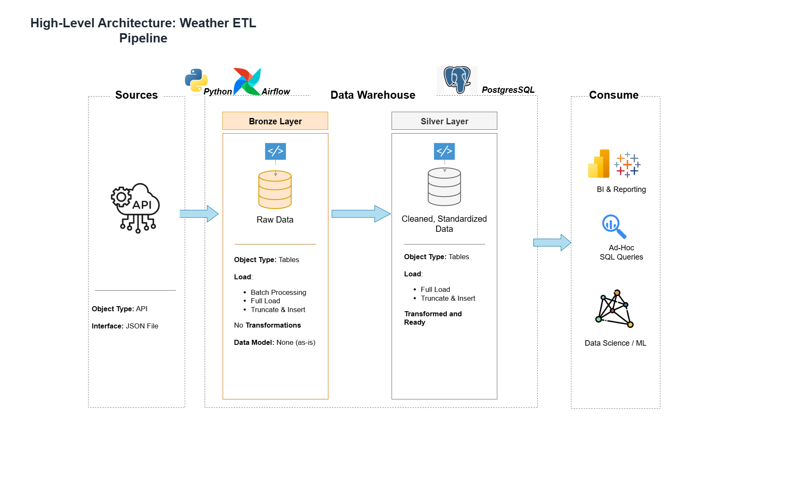
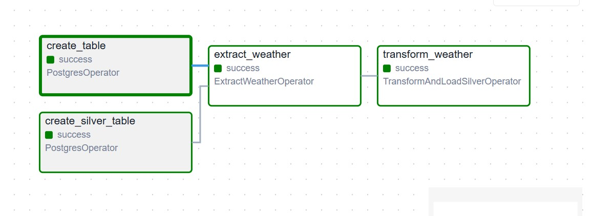
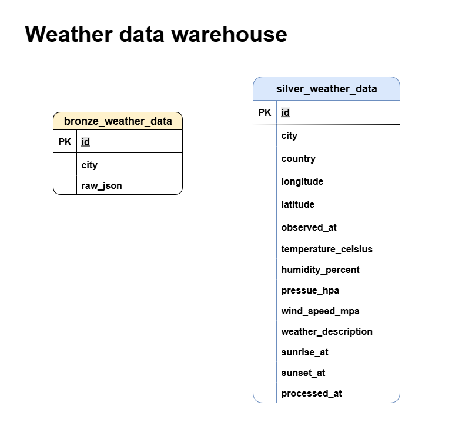

# 🌤️ Airflow Weather Data Pipeline
This project demonstrates a **data engineering ETL pipeline** built with **Apache Airflow**.  
It extracts daily weather data from the [OpenWeatherMap API](https://openweathermap.org/api),  
loads raw JSON into a **Bronze layer** in PostgreSQL, transforms it into a structured format,  
and stores the results in a **Silver layer** for analytics.

This project is designed to showcase **production-grade pipeline skills**:
- Airflow DAG orchestration with custom operators
- Layered data architecture (Bronze → Silver)
- Dockerized Airflow + PostgreSQL environment
- Industry-ready ETL best practices

---
## ✨ Features
- **API Integration**: Extracts daily weather data from OpenWeatherMap API.  
- **Airflow DAG Orchestration**: Custom operators for extract & transform steps.  
- **Layered Data Architecture**: Bronze (raw JSON) → Silver (clean structured).  
- **PostgreSQL Storage**: Reliable, production-ready storage engine.  
- **Dockerized Environment**: Reproducible local setup with Airflow + Postgres.

  
## 🏗️ High-Level Architecture
The pipeline follows the **Medallion Architecture** (Bronze → Silver → Gold) to ensure data quality and lineage. In this project we implement **Bronze** (raw JSON) and **Silver** (clean structured data).



## 🔄 Pipeline Workflow
The Airflow DAG defines the ETL orchestration:



### Task Breakdown
1. **create_table** → Initializes the Bronze table in PostgreSQL.  
2. **extract_weather** → Fetches daily weather JSON from API → Bronze.  
3. **create_silver_table** → Sets up schema for Silver table.  
4. **transform_weather** → Cleans & transforms Bronze data → Silver.  


## Tech Stack
<p>


</p>

## 📂 Project Structure
```
airflow-weather-pipeline-project/
├── airflow/
│   ├── dags/
│   │   └── weather_etl.py                # Main DAG definition
│   ├── plugins/
│   │   └── operators/
│   │       ├── extract_weather_operator.py   # Extract & Load → Bronze
│   │       └── transform_load_operator.py    # Transform & Load → Silver
│   └── requirements.txt  # Python dependencies
├── docker/
│   ├── .env.example                       # Example env vars (add API key here)
│   └── docker-compose.yml                 # Airflow + Postgres setup
├── sql/
│   ├── ddl_bronze_weather_data.sql        # Bronze table schema
│   └── ddl_silver_weather_data.sql        # Silver table schema
├── docs/
│   ├── data_architecture.png              # High-level architecture diagram
│   ├── pipeline_workflow.png              # Airflow DAG screenshot
│   └── data_model.drawio.png              # Data model (ERD)
├── .gitignore
└── README.md
```
## Data model
The pipeline uses a multi-layered data warehouse design:

- **Bronze Layer**: Stores raw JSON responses from the weather API.
- **Silver Layer**: Stores cleaned and structured data for analytics.

Below is the entity-relationship diagram:


# 1. Clone repository
git clone https://github.com/yourname/weather-pipeline.git
cd weather-pipeline

# 2. Start services
docker-compose up -d

# 3. Initialize Airflow DB
docker exec -it airflow-webserver airflow db init

# 4. Access Airflow UI
http://localhost:8080
(username: airflow, password: airflow)

## 🚀 Future Improvements
- Add Gold Layer (aggregated weather metrics).  
- Deploy to cloud (AWS/GCP/Azure).  
- Add tests for data validation.  
- Add monitoring with Airflow SLA & alerts.  
